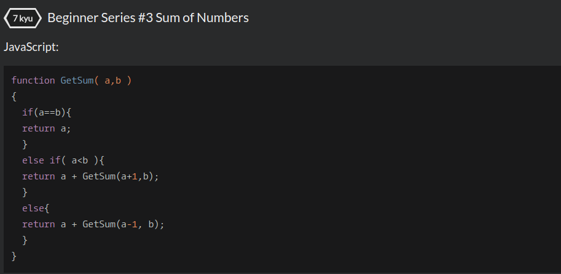

## CodeWars Challenge- 2
1. Given two integers a and b, which can be positive or negative, find the sum of all the numbers between including them too and return it. If the two numbers are equal return a or b.

Note: a and b are not ordered!

*Examples Given:*
1. GetSum(1, 0) == 1   // 1 + 0 = 1
2. GetSum(1, 2) == 3   // 1 + 2 = 3
3. GetSum(0, 1) == 1   // 0 + 1 = 1
4. GetSum(1, 1) == 1   // 1 Since both are same
5. GetSum(-1, 0) == -1 // -1 + 0 = -1
6. GetSum(-1, 2) == 2  // -1 + 0 + 1 + 2 = 2

## Languages Used

1. JavaScript

## My solution:

My first step was to set up the conditional provided, if the two numbers were equal then only one number would need to be returned. If the two numbers are not equal then my else if statement is checked, in this case I decided to check if a was less than b.

If a was less than b then I needed a to be returned (since the sum needed to include the sum of the numbers in between the two numbers and the numbers themselves. ) At this point I return a and need to call the GetSum function, this time incrementing a by 1, in order to continue getting all the numbers between a and b.

The last statement in this function, the else statement takes place if a is grater than b.

Unless, or until(since I have a increase or decrease by 1), a and b are equal this function will run through summing up all the numbers between a and b.
